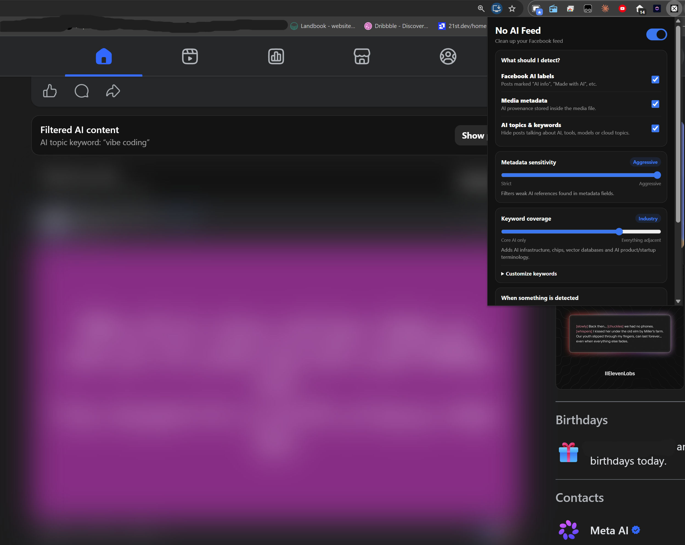

# No AI Feed

### Hide AI — or anything else you don’t want — from Facebook and YouTube.

A Chrome extension that can filter **AI content, unwanted topics, creators, Facebook pages and YouTube channels** from your feeds.

## [⬇️ Download .ZIP](https://github.com/Ibrahim-3d/No-AI-Feed/archive/refs/heads/main.zip)

**Free for personal use · No tracking · No external AI · No image scanning**

---

## Install in 60 seconds

1. **[Download .ZIP](https://github.com/Ibrahim-3d/No-AI-Feed/archive/refs/heads/main.zip)**.
2. Extract the ZIP.
3. Open `chrome://extensions` in Chrome.
4. Turn on **Developer mode**.
5. Click **Load unpacked**.
6. Select the extracted `No-AI-Feed-main` folder.
7. Open **Facebook or YouTube** and **refresh once**.

Then click the **No AI Feed** extension icon and choose what you want hidden.

> Already had Facebook or YouTube open while installing? Refresh that tab once so the extension can start filtering.

  

---

## Hide whatever you don’t want to see

No AI Feed includes **personal filters**.

Add a rule, choose what kind it is, and it works across your supported feeds.

| Rule | Example | What happens |
| --- | --- | --- |
| **Topic / phrase** | `crypto`, `football transfers`, `politics` | Hides posts and videos that mention it |
| **Creator / page / channel** | `MrBeast`, a Facebook page, a YouTube channel | Hides content from that source |
| **Never hide exception** | `cloud photography` | Keeps matching content visible even if another text rule matches |

Your personal rules work **even if you turn the built-in AI topic filter off**.

When No AI Feed can identify the page or channel you are currently viewing, it can also offer a **Block current creator/page/channel** shortcut.

---

## Built-in AI filtering

No AI Feed still includes its original AI-focused filters:

| | Filter | What it can hide |
| --- | --- | --- |
| 🏷️ | **Facebook AI labels** | Posts Meta identifies as AI-generated |
| 📄 | **Media metadata** | AI-generation information stored in supported Facebook media |
| 🔤 | **Built-in AI topics** | Facebook posts and YouTube videos mentioning AI tools, models or related topics |

Built-in filtering includes **ChatGPT, OpenAI, Claude, Gemini, Midjourney, Sora, Higgsfield, Astra, GPT-6 Astra, 3D Jutsu, Genjutsu** and many more AI-related terms.

Adjust the sensitivity from focused AI filtering to much broader adjacent technology terms.

---

## YouTube support

No AI Feed can filter matching videos from:

- Home recommendations
- Search results
- Subscriptions and channel grids
- Watch-page recommendations
- Shorts cards

It checks visible card information such as the **title, channel name and visible text**. It does not read transcripts or analyze the video itself.

---

## Blur it or remove it

Choose what happens when something matches:

- **Blur** — hide the content but keep a button to reveal it.
- **Remove** — remove it completely from the feed.
- **Blur strength** — choose how strong the blur should be.
- **Show why** — see which topic, creator, label or keyword caused the filter.

---

## Private by design

Filtering happens locally in your browser.

- Your Facebook posts and YouTube video-card text are **not sent to us**.
- Your personal topic/creator rules stay **on your device**.
- Your media is **not uploaded to us**.
- No analytics, ad trackers or external AI services.

[Read the Privacy Policy →](./PRIVACY.md)

---

## Platform support

| Platform | Status |
| --- | --- |
| Facebook | ✅ Available |
| YouTube | ✅ Available |
| Instagram | ⏳ Planned |
| X / Twitter | ⏳ Planned |
| LinkedIn | ⏳ Planned |
| Reddit | ⏳ Planned |

The longer-term goal is **one personal feed filter across all your social platforms**.

---

## FAQ

### Can I block a specific creator, Facebook page or YouTube channel?
Yes. Add it as a **Creator / page / channel** rule. Content from matching sources will be blurred or removed according to your settings.

### Can I hide a topic that has nothing to do with AI?
Yes. Personal topic rules can filter any visible topic or phrase — for example crypto, a TV show, politics, football transfers or anything else you do not want in your feed.

### Can it block Higgsfield and Astra content?
Yes. Higgsfield, Astra, GPT-6 Astra, 3D Jutsu and related terms are included in the built-in AI topic list.

### Can I hide AI videos on YouTube?
Yes. No AI Feed filters matching video cards on YouTube Home, search results, subscriptions, channel pages, recommendations and Shorts.

### Is No AI Feed an AI image detector?
No. It does not scan image pixels, read video transcripts or use AI vision. It filters using platform labels, supported metadata and visible text rules.

### Does No AI Feed collect my browsing data?
No. Filtering is designed to happen locally in your browser.

---

## License

**No AI Feed is proprietary software. It is not open source.**

The source is publicly visible for transparency, security review, learning, and personal installation. Personal, non-commercial use is allowed under the license.

Without prior written permission, you may **not**:

- republish or redistribute the extension or its source code;
- upload it, a modified version, or a derivative to the Chrome Web Store or another marketplace;
- rebrand, white-label, resell, sublicense, or commercially distribute it;
- reuse substantial source code, UI, filtering logic, branding, or components in another commercial product or service; or
- use it as part of a paid client deliverable, subscription, bundled product, or other commercial offering.

**Copyright © 2026 Ibrahim Elrouby. All rights reserved.**

[Read the full license →](./LICENSE)

---

## Feedback

Found something that should have been filtered? Want another platform supported?

[Open an issue](https://github.com/Ibrahim-3d/No-AI-Feed/issues).

---

**No AI Feed** is an independent project and is not affiliated with or endorsed by Facebook, Meta, YouTube, Google, OpenAI, Anthropic, Higgsfield, Microsoft or any other company mentioned by its filters.

**© 2026 Ibrahim Elrouby · Proprietary software · All rights reserved.**

