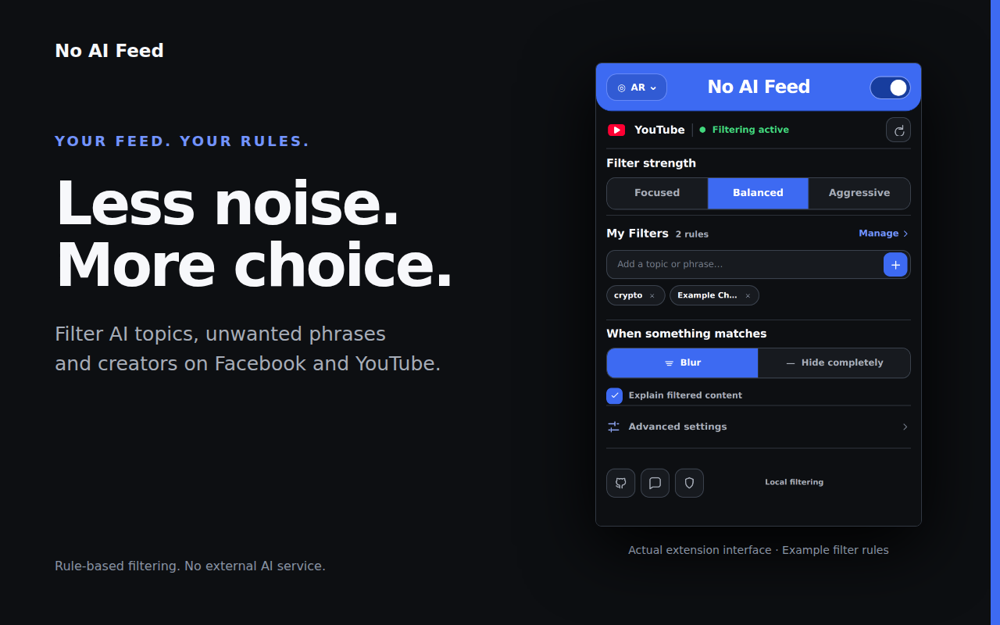

# No AI Feed

### Hide AI — or anything else you don't want — from Facebook and YouTube.

A Chrome extension that filters **AI content, unwanted topics, phrases, creators, Facebook pages and YouTube channels** from supported feeds.

## [Install from the Chrome Web Store →](https://chromewebstore.google.com/detail/no-ai-feed/fkohiolphgncfcihlegdmdnjgmfmigmi)

**Free for personal use · Local filtering · English + Arabic · No analytics**

  

---

## What you can filter

No AI Feed gives you two layers of control:

- **Built-in AI filtering** for AI tools, models and related topics.
- **Personal rules** for any topic, phrase, creator, Facebook page or YouTube channel you do not want in your feed.

| Rule | Example | What happens |
| --- | --- | --- |
| **Topic / phrase** | `crypto`, `football transfers`, `politics` | Hides matching posts and video cards |
| **Creator / page / channel** | A Facebook page or YouTube channel | Hides content from that source |
| **Never-hide exception** | `cloud photography` | Keeps matching content visible even when another rule matches |

Personal rules continue to work even when the built-in AI topic filter is off.

---

## Install

### Recommended — Chrome Web Store

1. **[Install No AI Feed from the Chrome Web Store](https://chromewebstore.google.com/detail/no-ai-feed/fkohiolphgncfcihlegdmdnjgmfmigmi)**.
2. Open or refresh **Facebook** or **YouTube**.
3. Click the **No AI Feed** extension icon.
4. Choose what should be blurred or hidden.

> If Facebook or YouTube was already open during installation, refresh the tab once.

### Manual / developer installation

Use this only if you specifically want to inspect or load the packaged source manually.

1. **[Download the v1.3.2 ZIP](https://github.com/Ibrahim-3d/No-AI-Feed/raw/refs/heads/main/dist/no-ai-feed-1.3.2-chrome.zip)**.
2. Extract it.
3. Open `chrome://extensions`.
4. Enable **Developer mode**.
5. Choose **Load unpacked** and select the extracted folder containing `manifest.json`.

---

## Built-in AI filtering

No AI Feed can filter using:

| | Filter | What it can hide |
| --- | --- | --- |
| 🏷️ | **Facebook AI labels** | Posts Meta identifies with supported AI labels |
| 📄 | **Media metadata** | Supported AI-generation information found in Facebook media metadata |
| 🔤 | **Built-in AI topics** | Facebook posts and YouTube videos mentioning AI tools, models or related topics |

The built-in topic list includes terms such as **ChatGPT, OpenAI, Claude, Gemini, Midjourney, Sora, Higgsfield, Astra, GPT-6 Astra, 3D Jutsu and Genjutsu**, plus broader AI-related vocabulary depending on the selected sensitivity.

---

## YouTube support

No AI Feed can filter matching video cards from:

- Home recommendations
- Search results
- Subscriptions and channel grids
- Watch-page recommendations
- Shorts cards

It uses visible card information such as the **title, channel name and visible text**. It does **not** read transcripts or analyze video pixels.

---

## Blur it or remove it

Choose what happens when something matches:

- **Blur** — hide the content while keeping a reveal control.
- **Remove** — remove matching content from the feed.
- **Blur strength** — control how strong the blur is.
- **Show why** — see which topic, creator, label or keyword caused the match.

---

## Private by design

Filtering happens locally in your browser.

- Your Facebook feed text and YouTube video-card text are **not sent to the developer**.
- Your personal topic and creator rules stay **on your device**.
- No analytics, advertising trackers or remote AI services are used.
- Optional Facebook metadata checks fetch supported Facebook/CDN media directly and inspect a limited portion locally.

[Read the Privacy Policy →](./PRIVACY.md)

---

## Platform support

| Platform | Status |
| --- | --- |
| Facebook | ✅ Available |
| YouTube | ✅ Available |
| Instagram | 🔎 Exploring |
| X / Twitter | 🔎 Exploring |
| LinkedIn | 🔎 Exploring |
| Reddit | 🔎 Exploring |

The current product focus is **reliable Facebook and YouTube filtering**. Other platforms are being evaluated and are not committed release promises.

---

## Current release

**v1.3.2** is the current public Chrome Web Store version.

- [Release notes](./store/CHANGELOG.md)
- [QA and known limitations](./store/QA.md)
- [Store listing source copy](./store/LISTING-EN.txt)

---

## FAQ

### Can I block a specific creator, Facebook page or YouTube channel?

Yes. Add it as a **Creator / page / channel** rule. Matching content will be blurred or removed according to your settings.

### Can I hide a topic that has nothing to do with AI?

Yes. Personal rules can target any visible topic or phrase.

### Can it block Higgsfield and Astra content?

The built-in AI topic list includes Higgsfield, Astra, GPT-6 Astra, 3D Jutsu and related terms.

### Can I hide AI videos on YouTube?

Yes. No AI Feed filters matching visible video cards across supported YouTube surfaces.

### Is No AI Feed an AI image detector?

No. It does not scan image pixels, read YouTube transcripts or run an AI vision model. It uses platform labels, supported metadata and visible-text rules.

### Does No AI Feed collect my browsing data?

The extension is designed to make filtering decisions locally. See the [Privacy Policy](./PRIVACY.md) for the exact data-handling model.

---

## Support

- **Bug or broken filtering:** [open an issue](https://github.com/Ibrahim-3d/No-AI-Feed/issues/new/choose)
- **Feature request:** [open an issue](https://github.com/Ibrahim-3d/No-AI-Feed/issues/new/choose)
- **Privacy or security-sensitive report:** [noai.extension@gmail.com](mailto:noai.extension@gmail.com) — do not post sensitive information in a public issue.
- **Security policy:** [SECURITY.md](./SECURITY.md)

---

## License

**No AI Feed is proprietary software. It is not open source.**

The source is publicly visible for transparency, security review, learning and personal installation. Personal, non-commercial use is allowed under the license.

Without prior written permission, you may **not**:

- republish or redistribute the extension or its source code;
- upload it, a modified version or a derivative to the Chrome Web Store or another marketplace;
- rebrand, white-label, resell, sublicense or commercially distribute it;
- reuse substantial source code, UI, filtering logic, branding or components in another commercial product or service; or
- use it as part of a paid client deliverable, subscription, bundled product or other commercial offering.

**Copyright © 2026 Ibrahim Elrouby. All rights reserved.**

[Read the full license →](./LICENSE)

---

**No AI Feed** is an independent project and is not affiliated with or endorsed by Facebook, Meta, YouTube, Google, OpenAI, Anthropic, Higgsfield, Microsoft or any other company mentioned by its filters.

**© 2026 Ibrahim Elrouby · Proprietary software · All rights reserved.**

